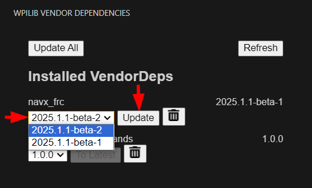

# NavX Releases and Issue Tracker

## Studica Hardware Manager

Used for updating and configuring all Studica electronics.

### Downloads

> [!NOTE]
> The downloads are ~220 MB to ~550 MB

> [!CAUTION]
> This app downloads new DFU drivers that may conflict with other vendor's software and devices!

**Windows 64-bit**: [Download](https://dev.studica.com/maven/release/firmware/app/win32/Studica_Hardware_Manager-Setup_1.0.0.exe)

**macOS**: [Download](https://dev.studica.com/maven/release/firmware/app/macOS/Studica_Hardware_Manager-Setup_1.0.0.pkg) 

### Supported Devices
* navX-micro
* navX-mxp
* navX2-micro
* navX2-mxp
* vmx
* vmx2
* Titan
* Servo Manager

## WPILib Vendordep

### Changelog

**v2025.1.1-beta-1**
- Same as 2024 rebuilt for 2025 to get teams going.

**v2025.1.1.beta-2**
- Switched to a Driver / JNI setup. This should increase performance for Java teams. 
- Currently, only SPI is enabled.
- Renamed vendordep to Studica.
    Results in new imports:
    ```Java
    import com.studica.frc.AHRS;
    ```
    ```C++
    #include "studica/AHRS.h"
    ```
- Added Enum for Comm Port & Update Rate selection in constructor.
    New Constructors look like this:
    ```Java
    navx = new AHRS(AHRS.NavXComType.kMXP_SPI);
    ```
    ```Java
    navx = new AHRS(AHRS.NavXComType.kMXP_SPI, AHRS.NavXUpdateRate.k50Hz);
    ```
    ```C++
    studica::AHRS navx{studica::AHRS::NavXComType::kMXP_SPI};
    ```
    ```C++
    studica::AHRS navx{studica::AHRS::NavXComType::kMXP_SPI, studica::AHRS::NavXUpdateRate::k50Hz};
    ```
- Fixed GetRate()
- Fixed Setting update rate in Java 
- Updated some print statements
- Applied patches introduced by robotpy [1](https://github.com/robotpy/robotpy-navx/blob/main/navx/src/ahrs.h.patch), [2](https://github.com/robotpy/robotpy-navx/blob/main/navx/src/sources.patch)

### VSCode Install
Starting this year (**2025**), Vendordeps can be installed directly from the WPILib VSCode.

1. From VSCode select the **WPILib Vendor Dependencies** extension. 

    <br/>

2. Find the NavX Listing and hit Install.

    <br/>

3. A pop-up will ask to run a build, hit yes. 

    <br/>

### VSCode Update

To update the vendordep, open the **WPILib Vendor Dependencies** find the navx_frc or Studica vendordep select the dropdown and the latest version. Hit the update button to install the update. 

    <br/>

### Direct JSON Link

For those that wish to use the old method of importing vendordeps, the JSON is here:

```
https://dev.studica.com/releases/2025/Studica-2025.1.1-beta-2.json
```