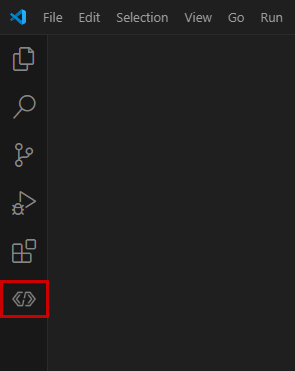
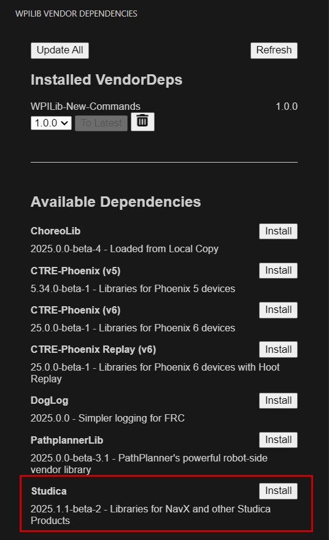
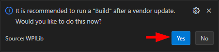

# NavX Releases and Issue Tracker

## Studica Hardware Manager

Used for updating and configuring all Studica electronics.

### Downloads

> [!NOTE]
> The downloads are ~220 MB to ~550 MB

> [!CAUTION]
> This app downloads new DFU drivers that may conflict with other vendor's software and devices!

**Windows 64-bit**: [Download](https://dev.studica.com/maven/release/firmware/app/win32/Studica_Hardware_Manager-Setup_1.0.0.exe)

**macOS**: [Download](https://dev.studica.com/maven/release/firmware/app/macOS/Studica_Hardware_Manager-Setup_1.0.0.pkg) 

### Supported Devices
* navX-micro
* navX-mxp
* navX2-micro
* navX2-mxp
* vmx
* vmx2
* Titan
* Servo Manager

## WPILib Vendordep

> [!NOTE]
> v2025.1.1-beta-1 is the same as the release for 2024. This release is to get teams going right away. Breaking changes and updates will happen in later releases. 

### VSCode Install
Starting this year (**2025**), Vendordeps can be installed directly from the WPILib VSCode.

1. From VSCode select the **WPILib Vendor Dependencies** extension. 

    <br/>

2. Find the NavX Listing and hit Install.

    <br/>

3. A pop-up will ask to run a build, hit yes. 

    <br/>


### Direct JSON Link

For those that wish to use the old method of importing vendordeps, the JSON is here:

```
https://dev.studica.com/releases/2025/NavX-2025.1.1-beta-1.json
```